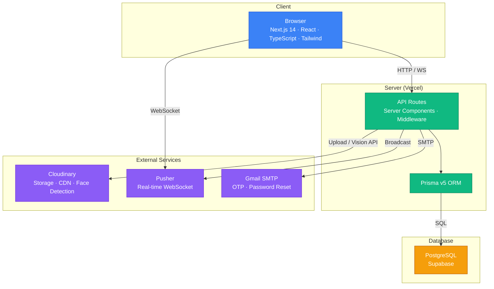

## System Architecture

```mermaid
graph TB
    subgraph client["Client"]
        browser["Browser\nNext.js 14 · React · TypeScript · Tailwind"]
    end

    subgraph server["Server (Vercel)"]
        api["API Routes\nServer Components · Middleware"]
        prisma["Prisma v5 ORM"]
    end

    subgraph db["Database"]
        postgres["PostgreSQL\nSupabase"]
    end

    subgraph services["External Services"]
        cloudinary["Cloudinary\nStorage · CDN · Face Detection"]
        pusher["Pusher\nReal-time WebSocket"]
        smtp["Gmail SMTP\nOTP · Password Reset"]
    end

    browser -->|"HTTP / WS"| api
    api --> prisma
    prisma -->|SQL| postgres
    api -->|Upload / Vision API| cloudinary
    api -->|Broadcast| pusher
    browser -->|WebSocket| pusher
    api -->|SMTP| smtp

    classDef c fill:#3b82f6,stroke:#1d4ed8,color:#fff
    classDef s fill:#10b981,stroke:#047857,color:#fff
    classDef d fill:#f59e0b,stroke:#b45309,color:#fff
    classDef e fill:#8b5cf6,stroke:#6d28d9,color:#fff

    class browser c
    class api,prisma s
    class postgres d
    class cloudinary,pusher,smtp e
```

