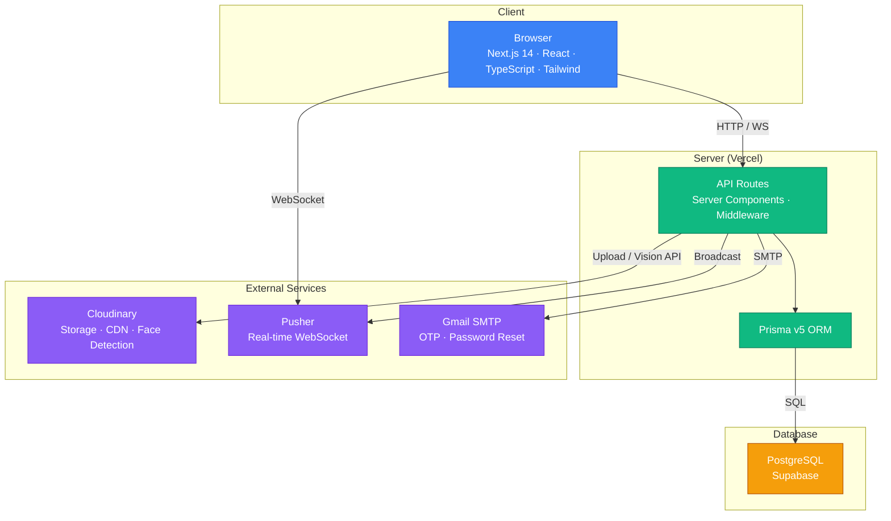
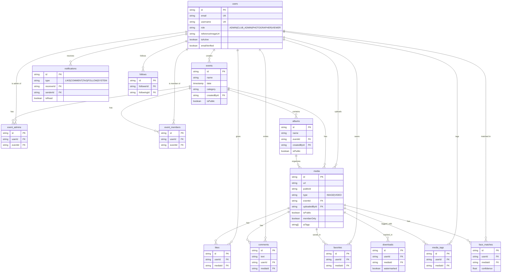

## System Architecture

```mermaid
graph TB
    subgraph client["Client"]
        browser["Browser\nNext.js 14 · React · TypeScript · Tailwind"]
    end

    subgraph server["Server (Vercel)"]
        api["API Routes\nServer Components · Middleware"]
        prisma["Prisma v5 ORM"]
    end

    subgraph db["Database"]
        postgres["PostgreSQL\nSupabase"]
    end

    subgraph services["External Services"]
        cloudinary["Cloudinary\nStorage · CDN · Face Detection"]
        pusher["Pusher\nReal-time WebSocket"]
        smtp["Gmail SMTP\nOTP · Password Reset"]
    end

    browser -->|"HTTP / WS"| api
    api --> prisma
    prisma -->|SQL| postgres
    api -->|Upload / Vision API| cloudinary
    api -->|Broadcast| pusher
    browser -->|WebSocket| pusher
    api -->|SMTP| smtp

    classDef c fill:#3b82f6,stroke:#1d4ed8,color:#fff
    classDef s fill:#10b981,stroke:#047857,color:#fff
    classDef d fill:#f59e0b,stroke:#b45309,color:#fff
    classDef e fill:#8b5cf6,stroke:#6d28d9,color:#fff

    class browser c
    class api,prisma s
    class postgres d
    class cloudinary,pusher,smtp e
```

---

## Database Schema

```mermaid
erDiagram
    users ||--o{ events : creates
    users ||--o{ event_admins : "is admin of"
    users ||--o{ event_members : "is member of"
    users ||--o{ media : uploads
    users ||--o{ likes : gives
    users ||--o{ comments : writes
    users ||--o{ favorites : saves
    users ||--o{ media_tags : tags
    users ||--o{ notifications : receives
    users ||--o{ face_matches : "matched in"
    users ||--o{ follows : follows

    events ||--o{ event_admins : has
    events ||--o{ event_members : has
    events ||--o{ albums : contains
    events ||--o{ media : has

    albums ||--o{ media : organizes

    media ||--o{ likes : has
    media ||--o{ comments : has
    media ||--o{ favorites : saved_in
    media ||--o{ media_tags : tagged_with
    media ||--o{ face_matches : has
    media ||--o{ downloads : tracked_in

    users {
        string id PK
        string email UK
        string username UK
        string role "ADMIN|CLUB_ADMIN|PHOTOGRAPHER|VIEWER"
        string referenceImageUrl
        boolean isActive
        boolean emailVerified
    }

    events {
        string id PK
        string name
        timestamp date
        string category
        string createdById FK
        boolean isPublic
    }

    event_admins {
        string id PK
        string userId FK
        string eventId FK
    }

    event_members {
        string id PK
        string userId FK
        string eventId FK
    }

    albums {
        string id PK
        string name
        string eventId FK
        string createdById FK
        boolean isPublic
    }

    media {
        string id PK
        string url
        string publicId
        string type "IMAGE|VIDEO"
        string eventId FK
        string uploadedById FK
        boolean isPublic
        boolean memberOnly
        string[] aiTags
    }

    likes {
        string id PK
        string userId FK
        string mediaId FK
    }

    comments {
        string id PK
        string text
        string userId FK
        string mediaId FK
    }

    favorites {
        string id PK
        string userId FK
        string mediaId FK
    }

    media_tags {
        string id PK
        string userId FK
        string mediaId FK
    }

    notifications {
        string id PK
        string type "LIKE|COMMENT|TAG|FOLLOW|SYSTEM"
        string receiverId FK
        string senderId FK
        boolean isRead
    }

    face_matches {
        string id PK
        string userId FK
        string mediaId FK
        float confidence
    }

    follows {
        string id PK
        string followerId FK
        string followingId FK
    }

    downloads {
        string id PK
        string userId FK
        string mediaId FK
        boolean watermarked
    }
```
